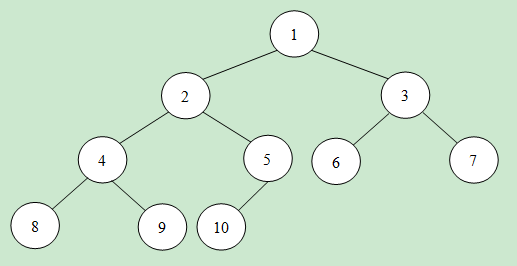

# 大数据

###1、海量数据处理的 Top K算法(问题)

问题描述：有N(N>>10000)个整数,求出其中的前K个最大的数。（称作Top k或者Top 10）

问题分析：由于(1)输入的大量数据；(2)只要前K个，对整个输入数据的保存和排序是相当的不可取的。

>可以利用数据结构的最小堆来处理该问题。
>
>最小堆如图所示，对于每个非叶子节点的数值，一定不大于孩子节点的数值。这样可用含有K个节点的最小堆来保存K个目前的最大值(当然根节点是其中的最小数值)。
>
>每次有数据输入的时候可以先与根节点比较。若不大于根节点，则舍弃；否则用新数值替换根节点数值。并进行最小堆的调整。
>
>由于仅仅保存了K个数据，有调整最小堆的时间复杂度为O(lnK)，因此TOp K算法(问题)时间复杂度为O(nlnK).

[source link](http://www.cnblogs.com/xudong-bupt/archive/2013/03/20/2971262.html)

